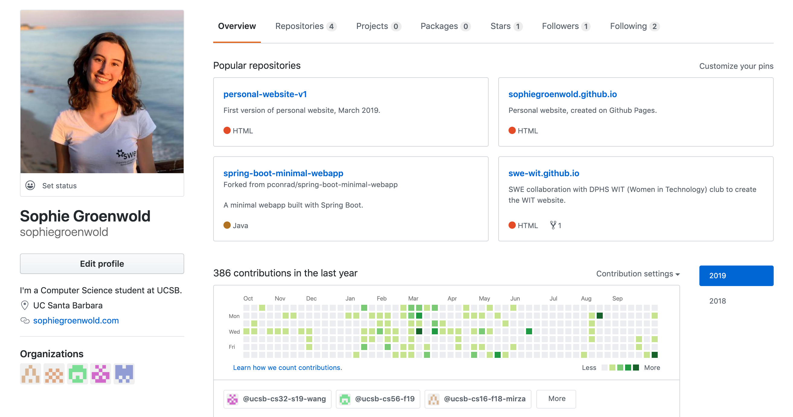
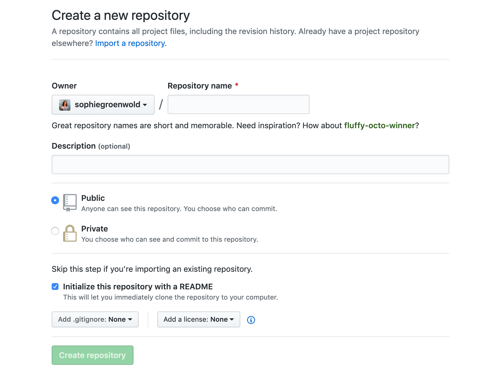

# Session 1: Github

*Teaching curriculum for ProgramHers.*

---

## Outline of Topics

- What is Git / Github? How are they different?
- Why version control is important for long-term development
- How to set up a personal Github account
- What is a repository?
    - What does `git clone` do? → How to clone your repository

---

## What is Git / Github?

**Git** is a system to manage code development. It keeps track of the different versions and programmers of a programming project.

**Github** is an online hosting system for Git projects. 

Both are examples of version control software. 

→ **Version control** is an important part of code development. There's many reasons that long-term projects require version control:

- if you make a mistake and want to go back to an earlier version of your code,
- if you're working with multiple people and you want to know who's been doing what,
- if you want to base multiple projects off of one starter project,

etc. 

## How do I get started with Git & Github?

You need to make a Github account!

1. Start by visiting [github.com](https://github.com), then click *Sign Up* in the upper left corner*.*  
2. Fill out your info and click *Select a Plan* at the bottom. 
3. Choose the free one (lol). 
4. Complete the setup. 
5. A verification email will be sent to the email address you specified. Go ahead and verify your account.
6. You'll be taken to the *Create a new repository* page but we are going to do this in a later step. You can skip that for now.
7. Click the icon in the top left corner, and then select *Signed in as [your username]* on the drop-down menu. You're now looking at your Github account!

For example, this is my Github account! It displays my repositories, contribution history, and organizations. 

## What are the basic elements on this page?

- **Repositories:** a Github repository is like a folder that holds all the files you need for a specific project (we call them "repos" for short)
- **Contribution history:** the little squares you see correspond to a day, and the more green it is, the more work you did using Github that day.
- **Organizations:** a Github organization is where you can store multiple repositories that will be used by its members. We won't be using one in ProgramHers, but they may be helpful in the future.

## Make a repository

1. On the top, there is a tab that says *Repositories.* Go ahead and click that; there won't be anything there yet, but we'll change that now!
2. On the right side of the page, there is a green button that says *New*. Click that, and you'll see this page:

3. For *Repository name*, you should enter:

*[your username].github.io*

Where *[your username]* is the username of your Github account. This will be the URL of your website!

4. You can enter information in the *Description* field if you want to, but you'll be able to edit this later, too. 

5. Make sure that you have selected *Public* and *Initialize this repository with a README.* You'll come to learn what those two settings mean later. 

6. Click *Create repository* and you've made your first ever repo!

## Get ready to code!

The last thing we're going to do is to clone this repository from the remote repository to your local computer. 

- **Clone:** this basically means the same thing as copy!
- **Remote:** existing on Github.
- **Local:** existing on your computer.

There's a big, green button on the left-hand side of the repository page that says *Clone or download.* Click that and copy the weird stuff in the box. 

Then, open a *command-line interface.* On my Mac, it's called *Terminal,* and it looks like this:

You just open it like you would any other app.

If you're using a different computer / operating system, there should still be a command line application available. On Windows it's called "Command Prompt."

Type the following:

`git clone [paste what you copied!]`

and then hit enter. Now when you type `ls` (which is short for list), you'll see a list of your files, including `[your username].github.io`.

You now have the repository downloaded onto your local computer. 

*To be continued... in Session 2!*

---

*Written by Sophie Groenwold, May 2020.*
